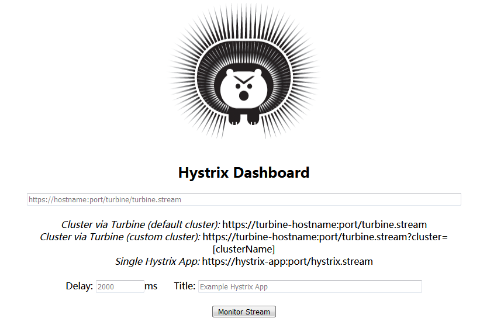
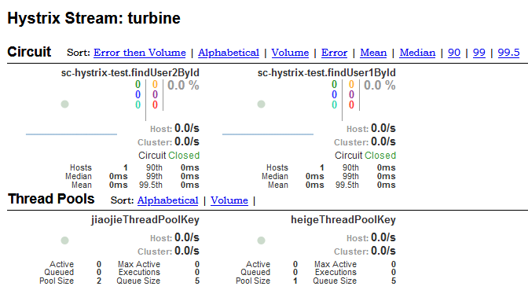

# dashboard hystrix可视化监控界面

使用dashboard可视化来监控某个服务jvm产生的hystrix数据，界面如下：

URL：为监控服务jvm的hystrx路径，

普通的服务hystrix监控路径：http://ip:port/hystrix.stream

turbine监控路径：http://ip:port/turbine.stream

Delay：为刷新的频率。

Title：为这次监控命名。



点击Monitor Stream按钮后，开始监控，如果没有数据界面为空，如果有监控数据了，则界面如下：



## 1.1 pom.xml

```xml
		<!-- spring cloud hystrix Dashboard -->
		<dependency>
			<groupId>org.springframework.cloud</groupId>
			<artifactId>spring-cloud-starter-netflix-hystrix-dashboard</artifactId>
		</dependency>
```

## 1.2 application.yml

没有什么特殊的配置

## 1.3 HystrixDashboardApplication

```java
@SpringBootApplication
@EnableHystrixDashboard
public class HystrixDashboardApplication {
	
	public static void main(String[] args) {
		SpringApplication.run(HystrixDashboardApplication.class, args);
	}

}

```

### 1.4 docker 启动脚本

docker run -itd --cap-add=SYS_PTRACE --name sc-hystrix-dashboard --net host -e JAVA_OPTS="-Xms100m -Xmx100m -Xmn60m -XX:+UseParNewGC -XX:+UseConcMarkSweepGC" -e APP_ENV="--spring.profiles.active=dev --server.port=8030" dyit.com:5000/sc/sc-hystrix-dashboard:1.0.1 