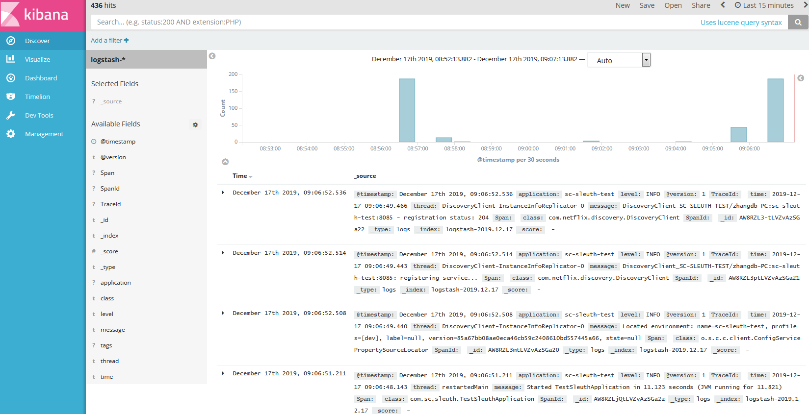

# 链路跟踪 sleuth

​		微服务跟踪(sleuth)其实是一个工具,它在整个分布式系统中能跟踪一个用户请求的过程(包括数据采集，数据传输，数据存储，数据分析，数据可视化)，捕获这些跟踪数据，就能构建微服务的整个调用链的视图，这是调试和监控微服务的关键工具。

## 1.sleuth原理

sleuth会在起点服务处，产生一个唯一序号作为整个请求的序号(TraceId)，然后在每个经过的服务生产一个唯一序号(SpanId)代表请求的服务序号，然后通过日志把TraceId和SpanId串起来，形成请求日志序号，这样你就可以根据日志的TraceId部分来识别整个请求都经过了那些服务SpanId。

如果服务请求使用了spring cloud提供的ribbon和feign，则会在请求中自动把sleuth相关信息带进去，传递到下一个服务请求。

## 2. sleuth配置

sleuth配置相对简单，只需要在pom.xml中加入启动依赖配置就可以了，Spring Boot启动会自动加载和配置sleuth。

### 2.1 pom.xml

```xml
		<!-- spring cloud sleuth -->
		<dependency>
			<groupId>org.springframework.cloud</groupId>
			<artifactId>spring-cloud-starter-sleuth</artifactId>
		</dependency>
```

### 2.2 application.yml

sleuth对配置无要求。

### 2.3 Application.java

sleuth无须配置任何源注释

## 3.sleuth 测试

发送请求：http://192.168.5.31:8085/user/1，并观察sc-sleuth-test和sc-sampleservice的日志输出，其中sc-sleuth-test会使用ribbon调用sc-sampleservice服务，例如：

sc-sleuth-test的日志输出如下：

```
2019-12-17 09:19:56.855[sc-sleuth-test,a5fa777ee2316237,a5fa777ee2316237,false][http-nio-8085-exec-5] INFO  com.sc.sleuth.controller.TestSleuth1Controller - find user[User [id=1, username=account1, name=张三, age=20, balance=100.00]] by id[1].
```

这里的TraceId=a5fa777ee2316237，SpanId=a5fa777ee2316237，如果TraceId等于SpanId，则说明为起点服务。

sc-sampleservice的日志输出如下：

```
2019-12-17 09:19:59.912  INFO [sc-sampleservice,a5fa777ee2316237,7e39ccc4e161e7a1,false] 1 --- [nio-8000-exec-6] c.s.s.controller.UserController          : finded User:User [id=1, username=account1, name=张三, age=20, balance=100.00]
```

这里的TraceId=a5fa777ee2316237，SpanId=7e39ccc4e161e7a1，很明显TraceId和上面的sc-sleuth-test的日志中TraceId相同，说明是同一请求相关，而SpanId不同说明同一个请求调用链中不同的服务。

## 4.日志格式

sleuth起步依赖和自动配置会自动修改logback的日志，使其满足基于sleuth个输出，但有时你要了解对于logback格式，因为可能要基于rabbitmq输出到ELK中。如下例子定义了两种输出，1.控制台输出、2.Rabbimtq AMQP输出。

```xml
<?xml version="1.0" encoding="UTF-8"?>
<configuration>
    <springProperty scope="context" name="APP_NAME" source="spring.application.name"/>
	<!-- 控制台输出 -->
	<appender name="STDOUT" class="ch.qos.logback.core.ConsoleAppender">
		<encoder	class="ch.qos.logback.classic.encoder.PatternLayoutEncoder">
			<!--格式化输出：%d表示日期，%thread表示线程名，%-5level：级别从左显示5个字符宽度%msg：日志消息，%n是换行符 -->
			<!-- 非sleuth环境日志格式: %d{yyyy-MM-dd HH:mm:ss.SSS} [%thread] %-5level %logger{50} - %msg%n -->
			<!-- sleuth环境日志格式: %d{yyyy-MM-dd HH:mm:ss.SSS}[${APP_NAME},%X{X-B3-TraceId:-},%X{X-B3-SpanId:-},%X{X-Span-Export:-}][%thread] %-5level %logger{50} - %msg%n -->
			<pattern>%d{yyyy-MM-dd HH:mm:ss.SSS}[${APP_NAME},%X{X-B3-TraceId:-},%X{X-B3-SpanId:-},%X{X-Span-Export:-}][%thread] %-5level %logger{50} - %msg%n</pattern>
		</encoder>
	</appender>
	<!-- Rabbitmq AMQP 输出 -->
	<appender name="AMQP"
		class="org.springframework.amqp.rabbit.logback.AmqpAppender">
		<layout>
			<pattern>{"time":"%d{yyyy-MM-dd HH:mm:ss.SSS}","application":"${APP_NAME}","TraceId":"%X{X-B3-TraceId:-}","SpanId":"%X{X-B3-SpanId:-}","Span":"%X{X-Span-Export:-}","thread": "%thread","level": "%level","class": "%logger{50}","message": "%msg"}</pattern>
		</layout>
		<host>192.168.5.29</host>
		<port>5672</port>
		<username>admin</username>
		<password>Rabbitmq-401</password>
		<applicationId>sc-sleuth-test</applicationId>
		<routingKeyPattern>logstash</routingKeyPattern>
		<declareExchange>true</declareExchange>
		<exchangeType>direct</exchangeType>
		<exchangeName>ex_logstash</exchangeName>
		<generateId>true</generateId>
		<charset>UTF-8</charset>
		<durable>true</durable>
		<deliveryMode>PERSISTENT</deliveryMode>
	</appender>

	<root level="INFO">
		<appender-ref ref="AMQP" />
		<appender-ref ref="STDOUT" />
	</root>
	
</configuration>
```

## 5.Sleuth与ELK配合使用

上面的日志格式例子，已经定义了基于Rabbitmq AMQP的日志输出，服务产生的日志会按照sleuth的日志格式输出到Rabbitmq的队列中。而ELK会订阅Rabbitmq队列的日志数据。

### 5.1 ELK概念

ELK时一个简称，其包括：Elasticsearch、Logstash、Kibana

Elasticsearch是实时全文搜索和分析引擎，提供搜集、分析、存储数据三大功能；是一套开放REST和JAVA API等结构提供高效搜索功能，可扩展的分布式系统。它构建于Apache Lucene搜索引擎库之上。

Logstash是一个用来搜集、分析、过滤日志的工具。它支持几乎任何类型的日志，包括系统日志、错误日志和自定义应用程序日志。它可以从许多来源接收日志，这些来源包括 syslog、消息传递（例如 RabbitMQ）和JMX，它能够以多种方式输出数据，包括电子邮件、websockets和Elasticsearch。

Kibana是一个基于Web的图形界面，用于搜索、分析和可视化存储在 Elasticsearch指标中的日志数据。它利用Elasticsearch的REST接口来检索数据，不仅允许用户创建他们自己的数据的定制仪表板视图，还允许他们以特殊的方式查询和过滤数据。

### 5.2 在Rabbitmq上定义相关队列

创建ex_logstash的exchange

创建q_logstash的queue

绑定ex_logstash到q_logstash，routingkey=logstash

### 5.3 基于docker简单安装ELK

#### start es port 9200 9300
docker run -d -it --name es -p 9200:9200 -p 9300:9300 elasticsearch

#### start kibana 5601
docker run -d -it --name kibana --link es:elasticsearch -p 5601:5601 kibana

#### start logstash
docker run -d -it logstash -e 'input { rabbitmq {host => "192.168.5.29" port => 5672 user => "admin" password => "Rabbitmq-xxx" exchange => "ex_logstash" queue => "q_logstash" durable => true } } output { elasticsearch { hosts => ["192.168.5.78"] } }'

### 5.4 客户端配置(spring cloud logback)

参照 **4.日志格式** 中的appender name="AMQP"，配置服务发生日志到Rabbitmq上。

### 5.5 测试验证ELK是否成功

发送请求：http://192.168.5.31:8085/user/1，其中sc-sleuth-test会使用ribbon调用sc-sampleservice服务。

访问kibana界面，第一步kibana会提示你创建索引，你可以创建基于@timestamp的索引，然后点击查询，就可以看到发生过来的日志数据了，例如：



  


