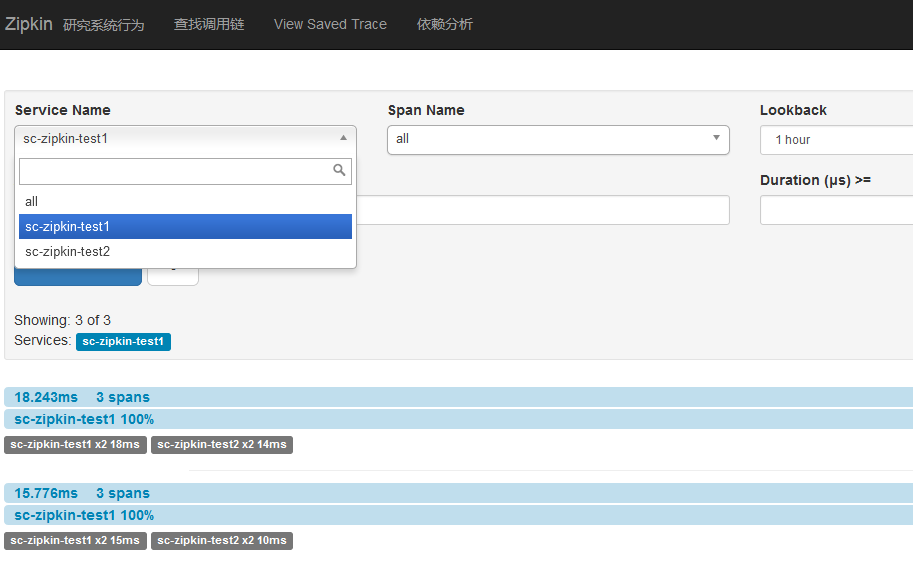
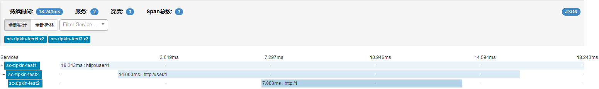
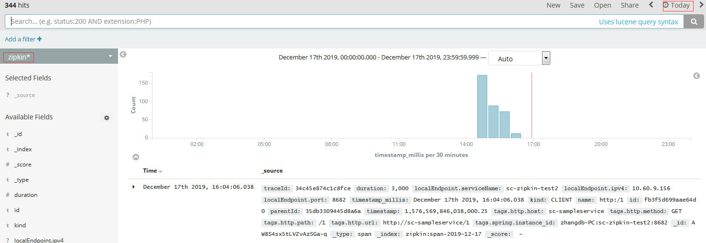

# Zipkin

收集系统的时序数据，从而追踪微服务架构的系统延时。

## 1.服务器端配置(基于队列)

基于队列模式的zipkin服务端，将订阅rabbitmq上的zipkin队列(queue)，队列上有数据将异步存放到es上。

存放到es上的索引格式：zipkin:span-yyyy-MM-dd，例如：zipkin:span-2019-12-17，你可以通过kibana来查看zipkin索引上的相关sleuth和zipkin数据。rabbitmq上创建zipkin队列都是zipkin-server自动完成的无须手工创建。

kibana查看zipkin的相关数据，可以查看"sleuth配置文档的FAQ部分"。

### 1.1 pom.xml

```xml
		<!-- spring cloud zipkin server -->
		<dependency>
			<groupId>io.zipkin.java</groupId>
			<artifactId>zipkin-autoconfigure-ui</artifactId>
		</dependency>
		<dependency>
			<groupId>io.zipkin.java</groupId>
			<artifactId>zipkin-server</artifactId>
		</dependency>
		<dependency>
			<groupId>io.zipkin.java</groupId>
			<artifactId>zipkin-autoconfigure-collector-rabbitmq</artifactId>
			<version>2.3.1</version>
		</dependency>
		<!-- 支持Elasticsearch 2.x 存储zipkin数据 -->
		<dependency>
			<groupId>io.zipkin.java</groupId>
			<artifactId>zipkin-autoconfigure-storage-elasticsearch-http</artifactId>
			<version>2.3.1</version>
		</dependency>
```

### 1.2 application.yml

```yaml
# zipkin server
zipkin:
  # zipkin数据收集
  collector:
    rabbitmq:
      addresses: 192.168.5.29:5672
      username: admin
      password: Rabbitmq-401
      queue: zipkin
  # zipkin数据存储    
  storage:
    type: elasticsearch
    elasticsearch:
      hosts: http://192.168.5.78:9200
```

可以通过查看ZipkinElasticsearchHttpStorageProperties类代码来分析，zipkin.storage.elasticsearch相关的配置属性，简单的只需要配置hosts属性指定es位置。

### 1.3 ZipkinServerApplication

```java
@SpringBootApplication
@EnableZipkinServer
public class ZipkinServerApplication {
	
	public static void main(String[] args) {
		SpringApplication.run(ZipkinServerApplication.class, args);
	}

}
```

## 2.服务客户端zipkin配置

### 2.1 pom.xml

```xml
		<!-- zipkin -->
		<dependency>
			<groupId>org.springframework.cloud</groupId>
			<artifactId>spring-cloud-starter-zipkin</artifactId>
		</dependency>
		<dependency>
			<groupId>org.springframework.amqp</groupId>
			<artifactId>spring-rabbit</artifactId>
		</dependency>
```

### 2.3 application.yml

```yaml
spring:  
  # sleuth和zipkin发送数据到rabbitmq配置
  rabbitmq:
    host: 192.168.5.29
    port: 5672
    username: admin
    password: Rabbitmq-401  
  # sleuth
  sleuth:
    sampler:
      # 采样数据1.0为100%，默认为0.1(10%)，采样越高越准确，但对服务器要求越高(性能和存储)
      percentage: 1.0
  # zipkin client
  zipkin:
    rabbitmq:
       # 发生数据到rabbitmq的队列名(同zipkin服务端配置队列名)
       queue: zipkin
```


## 3. 测试验证

### 3.1 客户端发送测试数据

请求调用链：浏览器->http://192.168.5.31:8681/user/1->sc-zipkin-test1->sc-zipkin-test2-sc-sampleservice

发送请求：http://192.168.5.31:8681/user/1，产生sleuth日志数据发送到Rabbitmq，zipkin server获取rabbitmq上的数据，存放到es上。zipkin界面上可以查看sc-zipkin-test1->sc-zipkin-test2-sc-sampleservice调用链的延时数据。

### 3.2 通过zipkin服务端界面查看zipkin数据





### 3.3 通过kibana查看zipkin数据

zipkin服务器端启动的时候，已经在es上创建了 zipkin:span-yyyy-MM-dd的相关索引了，例如： zipkin:span-2019-12-17，相关的sleuth和zipkin的数据也是存放到对于的索引上，你可以使用kibana的Management-Index Patterns->Create Index Pattern来创建**zipkin***显示模式，基于时间戳来索引。

注意：kibana默认只显示15分钟内的数据，你要切换为显示today的数据。




