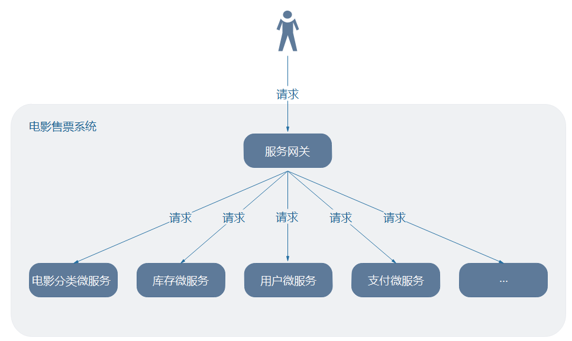

# spring cloud zuul

微服务网关：介于客户端和服务器端之间的中间层，所有的外部请求都会先经过微服务网关。微服务网关经过过滤出来和路由查询，转发请求到对应的服务器。

默认请求下zuul服务器，使用ribbon来定位eureka server中的微服务；同时，还整合了hystrix实现容错，所有经过zuul的请求都会在Hystrix命令中执行。

注意：尽管zuul起到了服务网关的作用，但还是强烈建议在生产环境中**zuul一定要前置nginx**。



## 1. zuul服务器配置

### 1.1 pom.xml

```xml
		<!-- spring cloud zuul -->
		<dependency>
			<groupId>org.springframework.cloud</groupId>
			<artifactId>spring-cloud-starter-netflix-zuul</artifactId>
		</dependency>
```

### 1.2 application.yml

```yaml
# 配置zuul->ribbon->使用APACHE HTTP Client
ribbon: 
  restclient:  
    enabled: true
# 配置zuul
zuul: 
  ignored-services: '*' 
  routes: 
    sc-sampleservice: /sampleservice/** 
```

配置zuul转发请求使用Apache HttpClient。

配置zuul忽略所有eureka上获取的服务，并指定某些服务对外开放。

这样是做的好处：

1. 解决安全问题，不能所有在eureka上的服务都暴露出去。

2. 通过routes配置可以指定服务的请求路径前缀和服务ID之间的映射(类似于DNS)，这样即使服务ID修改了，对外提供的URL不变。

3. 动态刷新路由配置(routes)，通过测试Edgware.SR6版本可以做到，git修改配置后，/bus刷新马上生效，无须重新启动zuul。

  POST请求，发送：http://config-ip:config-port/bus/refresh?destination=sc-zuul:** 

### 1.3 ZuulApplication.java

```java
@SpringBootApplication
@EnableZuulProxy
public class ZuulApplication {

	public static void main(String[] args) {
		SpringApplication.run(ZuulApplication.class, args);
	}

}
```

### 1.4 验证zuul启动是否成功

浏览器请求：http://zuul-ip:zuul-port/routes，查看返回的服务路由信息。

查看路由详细信息：http://192.168.5.31:8090/routes?format=details

查看应用的过滤器信息：http://192.168.5.31:8090/filters


## 2. zuul配置

### 2.1 配置使用路由前缀

```yaml
# 配置zuul
zuul: 
  # 忽略所有的服务
  ignored-services: '*' 
  # 指定请求前缀
  prefix: /api
  # 转发请求到服务时,是否去掉prefix前缀字符
  strip-prefix: true
  # 开放服务
  routes: 
    sc-sampleservice: /sampleservice/** 
```

关注：zuul.prefix=/api 和 zuul.strip-prefix=true 两处配置。

测试：http://192.168.5.31:8090/api/sampleservice/1，请求前缀加入了/api。

这样做还有一个好处，就是可以在zuul的前端加入nginx，nginx把所有的/api请求转发到zuul上。

**注意：zuul.routes的配置，支持/bus在线属性配置。**

### 2.2 敏感的Header设置

设置哪些Header可以穿透zuul传递到服务。

例如，设置zuul的sc-sampleservice服务路由，允许三个header请求头达到sc-sampleservice服务。

```yaml
# 配置zuul
zuul: 
  # 忽略所有的服务
  ignored-services: '*' 
  # 指定请求前缀
  prefix: /api
  # 转发请求到服务时,是否去掉prefix前缀字符
  strip-prefix: true
  # 配置路由
  routes: 
  	# 配置sc-sampleservice服务路由
    sc-sampleservice: 
      path: /sampleservice/** 
      sensitive-headers: Cookie,Set-Cookie,Authorization
```

关注：sensitive-headers: Cookie,Set-Cookie,Authorization

验证：查看zuul路由配置信息，http://192.168.5.31:8090/routes?format=details，返回：


你也可以通过设置，zuul.ignoredHeaders 来忽略一些Header。

以上的配置支持/bus动态刷新配置。

### 2.3 Zuul上传文件

对于小于1M上传，无须任何任何处理，可以正常上传。大于1M，则需要特殊设置，配置允许最大请求字节数和单个上传的字节数。不支持/bus动态刷新配置。

```yaml
spring:   
  http:   
    multipart: 
      # 整个请求大小限制(1个请求可能包括多个上传文件)
      max-request-size: 20Mb
      # 单个文件大小限制
      max-file-size: 10Mb   
```

测试：postman发送post请求，http://192.168.5.31:8090/api/sampleservice/uploadFile

注意：mulitpart的设置，在zuul和upload服务都要设置。

如果是在互联网上传文件，则要考虑到网络带宽和延时等问题，因此要加大超时时间，例如：

```yaml
hystrix:
  command:
    default:
      execution:
        isolation:
          thread:
            timeoutInMilliseconds: 10000

ribbon:
  ReadTimeout: 10000
  ConnectTimeout: 2000
```

同上面mulitpart的设置，zuul和upload服务都要设置这个超时时间。

**考虑到上面的配置为了上传，加大了请求大小字节数和超时时间，这在上传操作很有用，但如果是普通的服务调用，则会有安全问题，因此强烈建议为upload单独设置一个zuul服务器，只有这台zuul服务器才需要调大这些配置。**例如：/api/dfss/upload的请求，nginx会根据url来转发到这台占用于上传处理的zuul上。

### 2.4 zuul过滤器

Zuul大部分功能都是通过过滤器来实现的。Zuul中定义了4中标准过滤器类型，这些过滤器类型对应请求的典型生命周期。

PRE：这种过滤器在请求被路由之前调用。可利用这种过滤器实现身份认证、获取请求的微服务、记录调试等。

POUTING：这种过滤器将请求路由到微服务，用于构建发送给微服务的请求。

POST：这种过滤器在路由到微服务以后执行，用于为响应添加Http Header、收集统计信息、将响应发送给客户端等。

ERROR：发送错误是执行该过滤器。

STATIC：不常用，直接在Zuul中生成响应，不将请求转发到后端微服务。

#### 2.4.1 内置过滤器

Zuul了一些过滤器，谁zuul启动。

**@EnableZuulServer所启动的过滤器**

PRE 类型过滤器：

ServletDetectionFilter：检查请求是否通过了Spring Dispatcher。

FormBodyWrapperFilter：解析表单数据，并为请求重新编码。目前效率低，如果基于json传递请求体，则可禁止该过滤器。

DebugFilter：调试过滤器，当设置zuul.debug.request=true，并且请求加上debug=true参数，就会开启调试过滤器。

ROUTE 类型过滤器：

SendForwardFilter：使用Servlet RequestDispathcer转发请求，转发位置存在在RequestContext的属性FilterConstant.FORWARD_TO_KEY中。用于zuul自身转发(forward)。

```yaml
zuul:
  routes:
    path: /path-a/**
    url: forward:/path-b
```

POST 类型过滤器：

SendResponseFilter：代理请求响应写入响应。

ERROR 类型过滤器：

SendErrorFilter：若RequestContext.getThrowable()不为null，则默认转发到/error，也可以使用error.path属性来修改。

**@EnableZuulProxy所启动过滤器**

@EnableZuulProxy启动的过滤包含上面@EnableZuulServer启动的过滤器。

PRE 类型过滤器：

PreDecorationFilter：根据RouteLocator对象确定要路由到的地址(微服务位置)，以及怎样去路由。

查看sc-zuul-swagger-test项目的DocumentationConfig类，了解RouteLocator对象如果被使用。

ROUTE 类型过滤器：

RibbonRouteFilter：使用Ribbon、Hystrix、HTTP客户端发送请求。servletId在RequestContext的属性FilterConstants.SERVICE_ID_KEY中。

SimpleHostRoutingFilter：如果路由配置直接指定了服务的url，而不能从eureka中获取位置，则使用这个过滤器。

**禁止某个过滤器**

zuul.<SimpleClassName>.<filterType>.disable=true

例如：zuul.FormBodyWrapperFilter.pre.disable=true

#### 2.4.2 自定义过滤器

因为声明了@Component定义为SpringBean，zuul会自动识别并应用这个过滤器。

```java
@Component
public class PreRequestLogFilter extends ZuulFilter {
	/** 日志 */
	private final Logger logger = LoggerFactory.getLogger(PreRequestLogFilter.class);

	@Override
	public boolean shouldFilter() {
		return true;
	}

	@Override
	public Object run() throws ZuulException {
		RequestContext ctx = RequestContext.getCurrentContext();
		HttpServletRequest request = ctx.getRequest();
		logger.info("send [{}] request to [{}].", request.getMethod(), request.getRequestURL().toString());
		return null;
	}

	@Override
	public String filterType() {
		return FilterConstants.PRE_TYPE;
	}

	@Override
	public int filterOrder() {
		return FilterConstants.PRE_DECORATION_FILTER_ORDER - 1;
	}

}
```


### 2.4 Zuul容错和回退

#### 2.4.1 hystrix监控

http://zuul-ip:zuul-port/hystrix.stream，查看会查看到hystrix监控数据，也就是说默认情况下zuul的请求是收到zuul保护的，而且还能看出Thread Pools无相关数据，也证明了默认使用的hystrix隔离策略时SEMAPHORE。

#### 2.4.2 自定义回退类

因为声明了@Component定义为SpringBean，zuul会自动识别并应用这个回退提供者实现。

```java
@Component
public class MyFallbackProvider implements FallbackProvider {

	@Override
	public String getRoute() {
		// 表明为哪个微服务提供回退，* 表示所有微服务提供
		return "*";
	}

	@Override
	public ClientHttpResponse fallbackResponse(Throwable cause) {
		// 注意，只有hystrix异常才会好触发这个接口
		if (cause instanceof HystrixTimeoutException) {
			return response(HttpStatus.GATEWAY_TIMEOUT);
		} else {
			return this.fallbackResponse();
		}
	}

	@Override
	public ClientHttpResponse fallbackResponse() {
		return this.response(HttpStatus.INTERNAL_SERVER_ERROR);
	}

	private ClientHttpResponse response(final HttpStatus status) {
		return new ClientHttpResponse() {

			@Override
			public InputStream getBody() throws IOException {
				return new ByteArrayInputStream(("{\"code\":\""+ status.value()+"\",\"message\":\"服务不可用，请求稍后重试。\"}").getBytes());
			}

			@Override
			public HttpHeaders getHeaders() {
				HttpHeaders headers = new HttpHeaders();
				MediaType mt = new MediaType("application", "json", Charset.forName("UTF-8"));
				headers.setContentType(mt);
				return headers;
			}

			@Override
			public HttpStatus getStatusCode() throws IOException {
				return status;
			}

			@Override
			public int getRawStatusCode() throws IOException {
				return status.value();
			}

			@Override
			public String getStatusText() throws IOException {
				return status.getReasonPhrase();
			}

			@Override
			public void close() {
			}

		};
	}

}
```

测试验证：http://192.168.5.31:8090/api/sampleservice/1?sleep=2000，触发hystrix超时抛出，进而触发回退操作。


### 2.5 饥饿加载

zuul整合ribbon实现负载均衡，而ribbon默认是懒加载，可能会导致首次请求较慢。如果配置则修改为启动加载。

```yaml
zuul: 
  ribbon: 
    # 修改为启动加载(默认为懒加载)
    eager-load: 
      enabled: true
```

验证：启动时，查看log信息，会发现有DynamicServerListLoadBalancer字样。


### 2.6 QueryString 编码

如果要强制让query string与HttpServletRequest.getQueryString()保持一致，可使用如下配置：

```yaml
zuul: 
  # queryString保持一致
  forceOriginalQueryStringEncoding: true
```

注意：只对SimpleHostRoutingFilter有效。


### ~~2.7 Hystrix隔离策略和线程池~~

修改为线程隔离后，服务运行的线程池位置，两种模式只能选择一种：

1. 在同一个线程池RibbonCommand下运行，所有的服务都在这个RibbonCommand线程池要运行。
2. 每个服务都有一个独立的线程。

以上两个都有问题，第1种，如果所有的服务都在一个线程池下运行，那就失去了线程隔离的意义，一个服务出现阻塞，则整个RibbonCommand线程池瘫痪。第2种，如果调用100个服务，就分配100个线程池吗，这也有问题。

最理想，默认都使用RibbonCommand线程池调用服务，但可以为某个服务单独设置一个线程池。

#### 2.7.1 配置zuul使用thread隔离策略

默认情况下，Zuul的Hystrix隔离策略时**SEMAPHORE**。

可以使用zuul.ribbon-isolation-strategy=thread修改为THREAD隔离策略，修改后HystrixThreadPoolKey默认为RibbonCommand，这意味着，所有的路由HystrixCommand都会在相同的Hystrix线程池上执行。

修改后可以通过hystrix的dashborad观察，可以看到ThreadPools栏有数据了。


也可以为每个服务(路由)，使用独立的线程池，并使用hystrix.threadpool.服务名，来定制线程池大写：

```yaml
zuul:
  threadpool:
    useSeparateThreadPools: true
hystrix: 
  threadpool: 
    sc-sampleservice: 
      coreSize: 3    
```


### 2.8 设置超时时间

在基于zuul+hystrix+ribbon组合情况下设置读取超时时间(ReadTimeout)相对复杂一些，其需要先预估一个服务调用允许的超时时间，然后根据这个预估的参考值来计算相关属性值。

如下配置的**默认值**如下：

```properties
ribbon.restclient.enabled=false // 注意false的情况不支持读取超时时间设置
hystrix.command.<ServiceId>.execution.isolation.thread.timeoutInMilliseconds=4000
<ServiceId>.ribbon.ConnectTimeout=1000
<ServiceId>.ribbon.ReadTimeout=1000
```

设置某个服务的读取超时时间，要同时设置如下几个值：

```properties
ribbon.restclient.enabled=true
hystrix.command.<ServiceId>.execution.isolation.thread.timeoutInMilliseconds=xxxxx
<ServiceId>.ribbon.ConnectTimeout=xxxxx
<ServiceId>.ribbon.ReadTimeout=xxxxx
```

#### 例如：设置读取超时时间为10000ms

例如：我预估上传服务允许的超时时间为10000ms(10s)，那么我首先要设置：

```properties
<ServiceId>.ribbon.ConnectTimeout=1000
<ServiceId>.ribbon.ReadTimeout=10000
```

然后，根据公式计算hystrix的timeoutInMilliseconds时间，这个公式可以查看：org.springframework.cloud.netflix.zuul.filters.route.support.AbstractRibbonCommand#getRibbonTimeout(IClientConfig config, String commandKey)方法，源码。

**公式：timeoutInMilliseconds= (ribbonReadTimeout + ribbonConnectTimeout) * (maxAutoRetries + 1) * (maxAutoRetriesNextServer + 1);**

默认情况下：maxAutoRetries = 0，maxAutoRetriesNextServer = 1，因此计算出hystrix的**timeoutInMilliseconds=22000**

测试通过的application.yml配置如下：

```yaml
ribbon: 
  restclient:  
    enabled: true
# 设置hystrix    
hystrix: 
  command:
    sc-sampleservice:
      execution:
        isolation:
          thread:
            timeoutInMilliseconds: 22000     
# 为某个服务单独设置ribbon      
sc-sampleservice:
  ribbon:
    ReadTimeout: 10000
    ConnectTimeout: 1000    
```

测试验证：http://192.168.5.31:8090/api/sampleservice/1?sleep=9500，正常返回。

http://192.168.5.31:8090/api/sampleservice/1?sleep=11000，回退返回。


### 2.9 设置信号量

在默认的SEMAPHORE隔离策略下，信号量可以控制服务允许的并发访问量。

```yaml
zuul: 
  # 设置默认最大信号量
  semaphore: 
    max-semaphores: 100 
  # 设置某个服务的最大信号量
  eureka: 
    sc-sampleservice: 
      semaphore:
        max-semaphores: 50 
```


### 2.10 tomcat参数设置

通过设置tomcat参数来调整zuul对外服务能力

```yaml
server:  
  tomcat: 
    max-connections: 1000
    max-threads: 200
    min-spare-threads: 10
    accept-count: 50
```


## FAQ

### 1.安全问题

actutor安全问题？，待以后oauth2解决。


